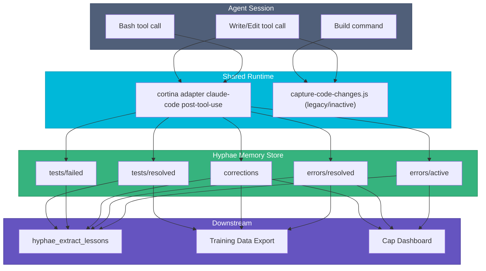

# Feedback Capture Hooks

The Lamella plugin now ships a Cortina-first capture path for Claude lifecycle hooks. Lamella still packages the hook catalog and related docs, but the shared runtime for lifecycle capture lives in Cortina rather than the older standalone JavaScript capture scripts.

See the [ecosystem LLM Training Guide](https://github.com/basidiocarp/.github/blob/main/docs/LLM-TRAINING.md) for how this data feeds into fine-tuning.

## Data Flow



## Hook Details

### Cortina PostToolUse Runtime

Watches Bash, Edit, Write, and MultiEdit results through `cortina adapter claude-code post-tool-use`. Cortina normalizes the host envelope, applies capture policy, dedupes repeated outcomes, and stores structured lifecycle signals in Hyphae or Rhizome.

**What it stores:**
- `errors/active` — command and error output (medium importance)
- `errors/resolved` — command, original error, and successful output (high importance)
- `corrections` — file path, original change, correction (high importance)
- validation outcomes for successful build or test commands
- export and ingest outcomes for pending code or document batches

**Training value:** Error/resolution pairs are natural SFT training data. "Given this error, here's the fix."


### capture-code-changes.js

Tracks file edits across a session. Triggers two actions:
1. After 5+ code file edits and a successful build → `rhizome export` (code graph update)
2. After 3+ document file edits → `hyphae ingest-file` for each (RAG re-indexing)

**What it triggers (not stores):**
- Rhizome code graph export (keeps knowledge graphs current)
- Hyphae document ingestion (keeps RAG index current)

## Error Observability

All hooks write failures to `/tmp/hyphae-hook-errors.log` via the `logHookError()` utility. The log is capped at 100 lines. Cap's Status page reads this log and shows hook health.

If hooks silently fail (e.g., Hyphae binary not found), check:

```bash
cat /tmp/hyphae-hook-errors.log
```

## Installation

Hooks are installed automatically by Lamella or Stipe. The shared Claude catalog now registers `cortina adapter claude-code post-tool-use` for the main lifecycle capture path and keeps the remaining Lamella hooks for packaging, evaluation, and local workflow behavior.

To verify installation:

```bash
cat ~/.claude/settings.json | grep -A3 "cortina adapter claude-code post-tool-use"
```

## Related

- [Hyphae: Training Data](https://github.com/basidiocarp/hyphae/blob/main/docs/TRAINING-DATA.md) — how captured data maps to training formats
- [Hyphae: Feedback Signals](https://github.com/basidiocarp/hyphae#feedback-signals) — what topics store what
- [Mycelium: Ecosystem Setup](https://github.com/basidiocarp/mycelium/blob/main/docs/ECOSYSTEM-SETUP.md) — how hooks get installed
- [Cap: Sessions & Lessons](https://github.com/basidiocarp/cap/blob/main/docs/GETTING-STARTED.md) — viewing captured data in the dashboard
