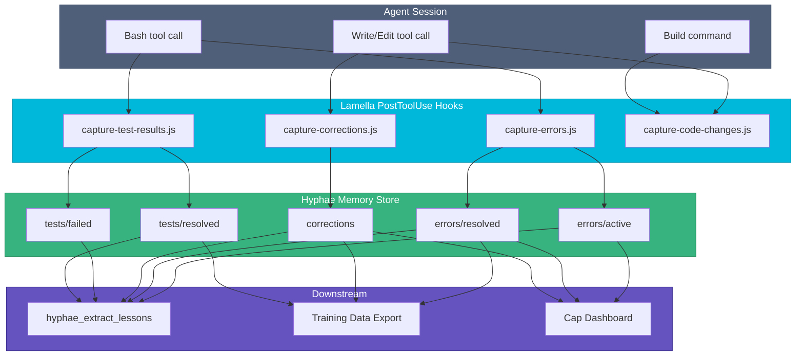
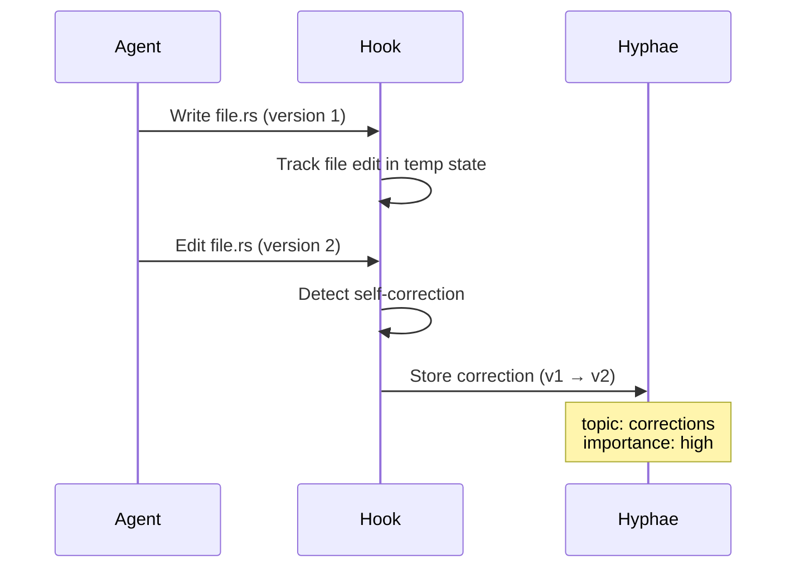

# Feedback Capture Hooks

Lamella's capture hooks run as Claude Code PostToolUse hooks. They observe agent behavior, detect patterns, and store signals in Hyphae for later analysis and lesson extraction.

See the [ecosystem LLM Training Guide](https://github.com/basidiocarp/.github/blob/main/docs/LLM-TRAINING.md) for how this data feeds into fine-tuning.

## Data Flow



## Hook Details

### capture-errors.js

Watches Bash tool results for error patterns (`error`, `Error`, `ERROR`, `failed`, `panic`). Tracks active errors in a temp file; when a subsequent Bash call succeeds for the same command, marks the error as resolved.

**What it stores:**
- `errors/active` — command and error output (medium importance)
- `errors/resolved` — command, original error, and successful output (high importance)

**Training value:** Error/resolution pairs are natural SFT training data. "Given this error, here's the fix."

### capture-corrections.js

Watches Write and Edit tool calls. When an agent edits a file it just wrote to (within the same session), that's a self-correction. The hook records both the original and corrected versions.

**What it stores:**
- `corrections` — file path, original change, correction (high importance)

**Training value:** These are natural DPO preference pairs. The original is "rejected," the correction is "chosen."



### capture-test-results.js

Watches Bash tool results for test runner output patterns (cargo test, vitest, pytest, jest, playwright, go test). Detects failures, tracks them, and marks resolution when tests pass.

**What it stores:**
- `tests/failed` — test runner, failure output (medium importance)
- `tests/resolved` — test runner, original failure, passing output (high importance)

**Training value:** Similar to error resolution pairs but specific to test failures.

### capture-code-changes.js

Tracks file edits across a session. Triggers two actions:
1. After 5+ code file edits and a successful build → `rhizome export` (code graph update)
2. After 3+ document file edits → `hyphae ingest-file` for each (RAG re-indexing)

**What it triggers (not stores):**
- Rhizome code graph export (keeps knowledge graphs current)
- Hyphae document ingestion (keeps RAG index current)

## Error Observability

All hooks write failures to `/tmp/hyphae-hook-errors.log` via the `logHookError()` utility. The log is capped at 100 lines. Cap's Status page reads this log and shows hook health.

If hooks silently fail (e.g., Hyphae binary not found), check:

```bash
cat /tmp/hyphae-hook-errors.log
```

## Installation

Hooks are installed automatically by `mycelium init --ecosystem` when Hyphae is detected. They're placed in `~/.claude/hooks/basidiocarp/` and registered as PostToolUse hooks in `~/.claude/settings.json`.

To verify installation:

```bash
cat ~/.claude/settings.json | grep -A3 "capture"
```

## Related

- [Hyphae: Training Data](https://github.com/basidiocarp/hyphae/blob/main/docs/TRAINING-DATA.md) — how captured data maps to training formats
- [Hyphae: Feedback Signals](https://github.com/basidiocarp/hyphae#feedback-signals) — what topics store what
- [Mycelium: Ecosystem Setup](https://github.com/basidiocarp/mycelium/blob/main/docs/ECOSYSTEM-SETUP.md) — how hooks get installed
- [Cap: Sessions & Lessons](https://github.com/basidiocarp/cap/blob/main/docs/GETTING-STARTED.md) — viewing captured data in the dashboard
