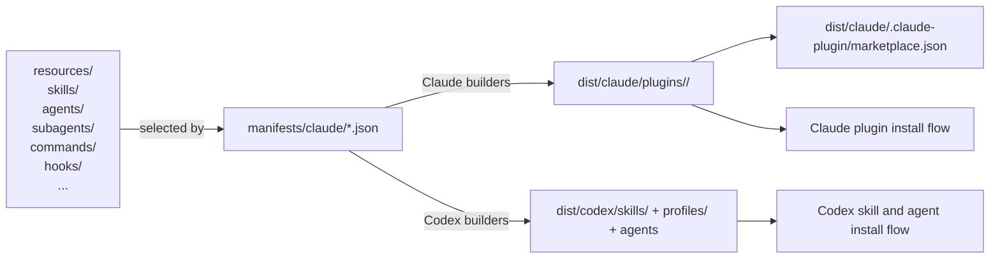

# Lamella Architecture

Lamella is a manifest-driven packaging system for AI coding resources. It takes
skills, agents, commands, hooks, templates, workflows, and related assets from
`resources/`, maps them through plugin manifests, and emits installable outputs
for Claude Code and Codex.

## Core Model

Lamella has three layers:

1. **Source resources**
   Skills, agents, subagents, commands, hooks, rules, templates, workflows,
   scripts, and MCP configs live under `resources/`.
2. **Manifest selection**
   Plugin manifests in `manifests/claude/*.json` define which resources belong
   to each plugin and what dependencies exist between them.
3. **Built outputs**
   Builders transform source resources into:
   - Claude Code plugins and a local marketplace under `dist/claude/`
   - Codex skill exports, custom agents, and profiles under `dist/codex/`

## Build Pipeline



## Directory Layout

```text
lamella/
├── resources/
│   ├── skills/          # Source skill directories with SKILL.md
│   ├── agents/          # Source agent markdown files and shared fragments
│   ├── subagents/       # Shared Claude/Codex subagent source
│   ├── commands/        # Source slash commands
│   ├── hooks/           # Hook definitions and docs
│   ├── rules/           # Standalone rule content
│   ├── templates/       # Reusable templates
│   ├── workflows/       # Workflow guides
│   ├── mcp-configs/     # MCP configuration assets
│   └── scripts/         # Helper scripts used by hooks and builds
├── manifests/
│   ├── claude/          # Claude plugin manifests, schema, and registry
│   └── codex/           # Generated Codex export manifests
├── builders/            # Claude and Codex build scripts
├── scripts/
│   ├── ci/              # Source and build validators
│   ├── plugins/         # Plugin build/install helpers
│   └── hooks/           # Hook support scripts
├── dist/
│   ├── claude/          # Built Claude marketplace and plugins
│   └── codex/           # Built Codex skills, agents, and profiles
└── docs/                # User, authoring, and reference docs
```

## Resource Packaging

| Resource Type | Source | Claude Output | Codex Output |
|---------------|--------|---------------|--------------|
| Skills | `resources/skills/<category>/<name>/SKILL.md` | `dist/claude/plugins/<plugin>/skills/<name>/SKILL.md` | `dist/codex/skills/<name>/SKILL.md` |
| Legacy agents | `resources/agents/<category>/<name>.md` | `dist/claude/plugins/<plugin>/agents/<name>.md` | Not emitted directly |
| Shared subagents | `resources/subagents/<category>/<name>/SUBAGENT.md` | `dist/claude/plugins/<plugin>/agents/<name>.md` | `dist/codex/profiles/<profile>/agents/<name>.toml` |
| Commands | `resources/commands/<category>/<name>.md` | `dist/claude/plugins/<plugin>/commands/<name>.md` | Not a primary Codex export target |
| Hooks | `resources/hooks/...` | `dist/claude/plugins/<plugin>/hooks/...` | N/A |
| Rules / Templates / Workflows | `resources/...` | copied as standalone support content where needed | optional support content |

Claude builds flatten category-oriented source paths into plugin-local names.
Codex builds export portable skill directories, generated custom agents, and
profile metadata.

## Primary Commands

Lamella’s preferred local entrypoint is `./lamella`.

```bash
./lamella build-marketplace
./lamella install core python typescript
./lamella list

./lamella build-codex
./lamella install-codex --all
./lamella update
```

The lower-level builders still exist for focused debugging or CI:

```bash
bash builders/build-claude-plugin.sh manifests/claude/core.json
bash builders/build-claude-marketplace.sh
bash builders/sync-codex-manifests.sh
bash builders/build-codex-skills.sh
```

## Validation

Lamella has two validation layers:

1. **Source validation**
   - resource structure
   - manifest references
   - cross-file references
   - command and agent frontmatter
2. **Built-output validation**
   - plugin directory integrity
   - marketplace output correctness
   - flattened resource packaging

Primary commands:

```bash
make validate
make build-marketplace
node scripts/ci/validate-build.js
```

## Current Scope

Lamella currently documents and packages:

- **25 plugins**
- **286 skills**
- manifest-driven Claude plugin builds
- Codex skill and agent exports
- a local marketplace and hosted marketplace flow

The main architectural work left is not “invent a build system.” It is keeping
dependency resolution, validation, distribution, and host parity aligned as the
content library evolves.
