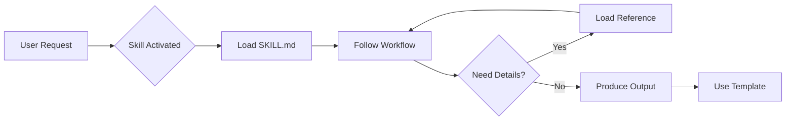

# What Are Skills?

Skills are modular packages that extend Claude from a general-purpose
assistant into a specialized collaborator for specific domains and workflows.

---

## The Problem Skills Solve

For complex, domain-specific work, you often need to explain your workflow
each session, remind Claude of best practices, supply templates, and reference
detailed documentation repeatedly. Skills solve this by packaging all of that
context into a reusable module that Claude loads on demand.

---

## What's Inside a Skill?

Each skill contains three types of content:

### 1. Instructions (SKILL.MD)

The core of every skill. This file contains workflow guidance for approaching
the domain step-by-step, decision frameworks for when to use different methods,
quality standards that define good output, and session patterns for starting,
progressing, and ending sessions.

### 2. Reference Documentation (references/)

Deep knowledge that Claude loads on demand to preserve context: method
explanations, domain-specific frameworks, best practices and anti-patterns,
and supporting research.

### 3. Templates (assets/)

Structured formats for consistent output: project document templates, tracker
templates, report formats, and handoff documents.

---

## How Skills Work

1. Activation: when your request matches a skill's domain, Claude loads the skill
2. Workflow: Claude follows the skill's prescribed approach
3. Progressive disclosure: detailed references load only when needed
4. Structured output: templates ensure consistent, useful deliverables

---

## Types of Skills

### Standalone Skills

Self-contained skills for specific tasks:

- **Brainstorm** — Multi-session ideation with versioned documents

### Pipeline Skills

Skills designed to work together in sequence:

- **Non-Fiction Book Factory** — From idea → validation → market research →
  architecture → chapters
- **Ebook Factory** — From discovery → concept development
- **Writing** — From voice DNA discovery → ghost writing

Pipeline skills pass structured "handoff documents" between stages, ensuring
continuity and quality.

---

## Key Concepts

### Session Continuity

Many skills support multi-session workflows spanning days or weeks through
versioned documents (each session creates a new version: v1, v2, v3), session
logs that track what happened when, and decision logs that capture reasoning,
not just conclusions.

### Modes

Some skills offer different operating modes: connected mode (Claude surfaces
connections to other work), clean-slate mode (fresh thinking without prior
context), and quick mode (rapid progress over deep exploration).

### Handoffs

Pipeline skills produce structured handoff documents that summarize what was
accomplished, meet explicit readiness criteria, and provide everything the next
skill needs.

---

## Benefits of Using Skills

| Without Skills                | With Skills                          |
| ----------------------------- | ------------------------------------ |
| Explain workflow each time    | Workflow is pre-defined              |
| Inconsistent output format    | Templates ensure consistency         |
| Context lost between sessions | Versioned documents maintain history |
| Ad-hoc quality standards      | Built-in quality checks              |
| Generic responses             | Domain-specialized collaboration     |

---

## Next Steps

To start using skills, see the [Your First Skill Tutorial](your-first-skill.md)
and [Categorizing Skills](categorizing-skills.md).
