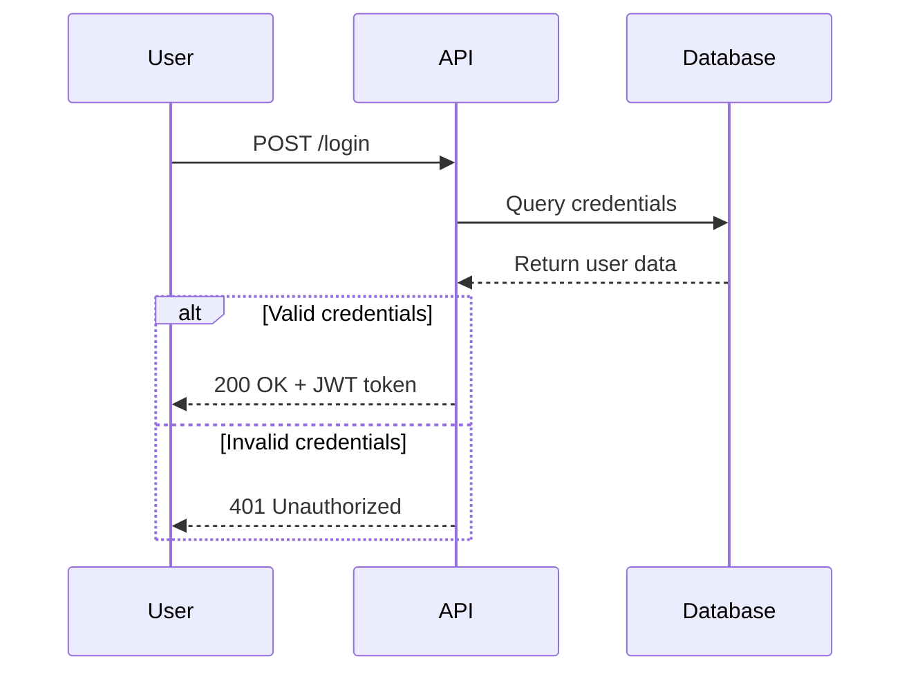
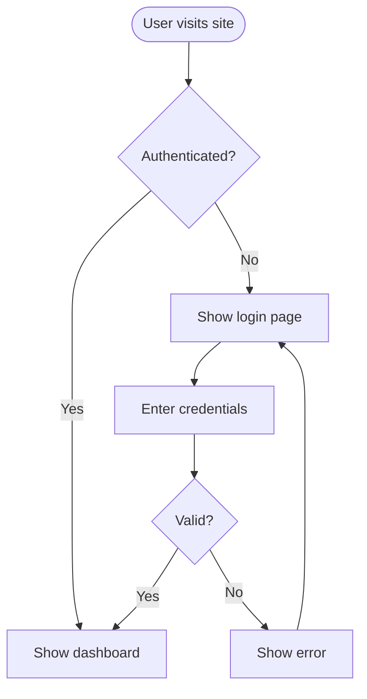
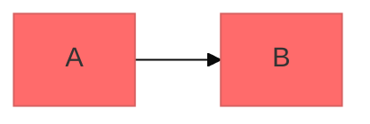

# Mermaid Diagramming


## Contents

- [Core Syntax](#core-syntax)
- [Diagram Type Selection](#diagram-type-selection)
- [Quick Start Examples](#quick-start-examples)
- [References](#references)
- [Configuration](#configuration)
- [Export](#export)

## Core Syntax

```mermaid
diagramType
  definition content
```

- First line declares type (`classDiagram`, `sequenceDiagram`, `flowchart`, `C4Context`, etc.)
- `%%` for comments
- Unknown words break diagrams; invalid parameters fail silently

## Diagram Type Selection

| Need | Diagram Type |
|------|-------------|
| Domain modeling, OOP design | Class Diagram |
| API flows, message sequences | Sequence Diagram |
| Processes, algorithms, decisions | Flowchart |
| Database schemas | ERD |
| Architecture (multi-level) | C4 Diagram |
| State machines, lifecycles | State Diagram |
| Branching strategies | Git Graph |
| Project timelines | Gantt Chart |

### C4 Level Selection

| Level | Type | Audience | When |
|-------|------|----------|------|
| 1 | C4Context | Everyone | Always |
| 2 | C4Container | Technical | Always |
| 3 | C4Component | Developers | Only if adds value |
| 4 | C4Deployment | DevOps | Production systems |
| - | C4Dynamic | Technical | Complex request flows |

## Quick Start Examples

### Class Diagram (Domain Model)
```mermaid
classDiagram
    Title -- Genre
    Title *-- Season
    Title *-- Review
    User --> Review : creates
// ... (8 lines trimmed)
        +string name
        +getTopTitles()
    }
```

### Sequence Diagram (API Flow)


### Flowchart (User Journey)


### ERD (Database Schema)
```mermaid
erDiagram
    USER ||--o{ ORDER : places
    ORDER ||--|{ LINE_ITEM : contains
    PRODUCT ||--o{ LINE_ITEM : includes
    
// ... (10 lines trimmed)
        decimal total
        datetime created_at
    }
```

## References

- [references/class-diagrams.md](references/class-diagrams.md) — Domain modeling, relationships, multiplicity
- [references/sequence-diagrams.md](references/sequence-diagrams.md) — Actors, messages, activations, alt/opt/par blocks
- [references/flowcharts.md](references/flowcharts.md) — Node shapes, connections, subgraphs
- [references/erd-diagrams.md](references/erd-diagrams.md) — Entities, cardinality, keys
- [references/c4-diagrams.md](references/c4-diagrams.md) — C4 model diagrams, architecture patterns, microservices
- [references/c4-syntax.md](references/c4-syntax.md) — Complete C4 Mermaid syntax reference, Mermaid limitations
- [references/c4-mistakes.md](references/c4-mistakes.md) — C4 anti-patterns and common mistakes
- [references/advanced-features.md](references/advanced-features.md) — Themes, styling, layout, export

## Configuration



Themes: `default`, `forest`, `dark`, `neutral`, `base`
Layout: `dagre` (default), `elk` (complex diagrams)
Look: `classic`, `handDrawn`

## Export

- GitHub/GitLab/Notion/Obsidian — native rendering
- [mermaid.live](https://mermaid.live) — PNG/SVG export
- CLI: `mmdc -i input.mmd -o output.png` (`npm i -g @mermaid-js/mermaid-cli`)
