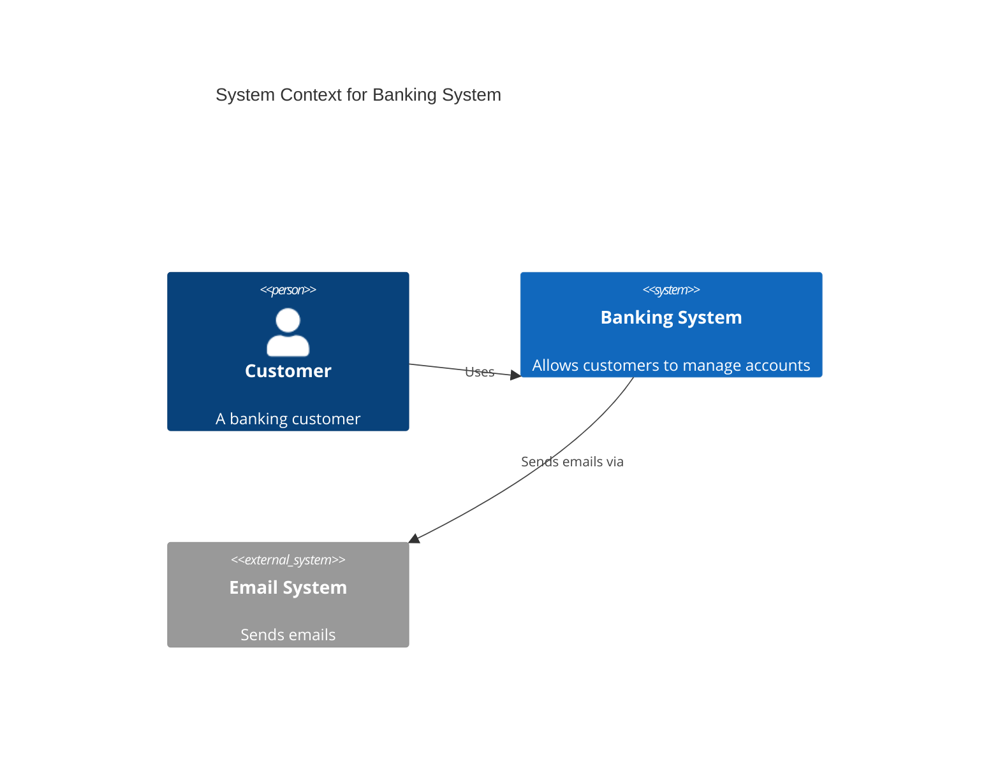
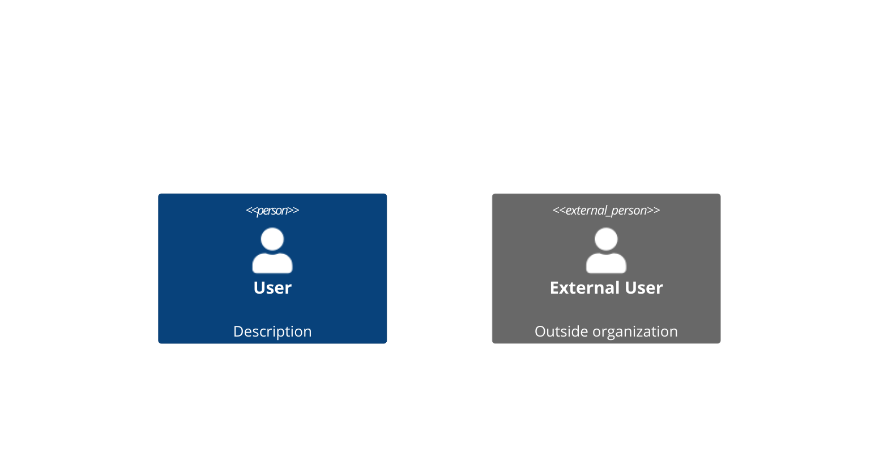
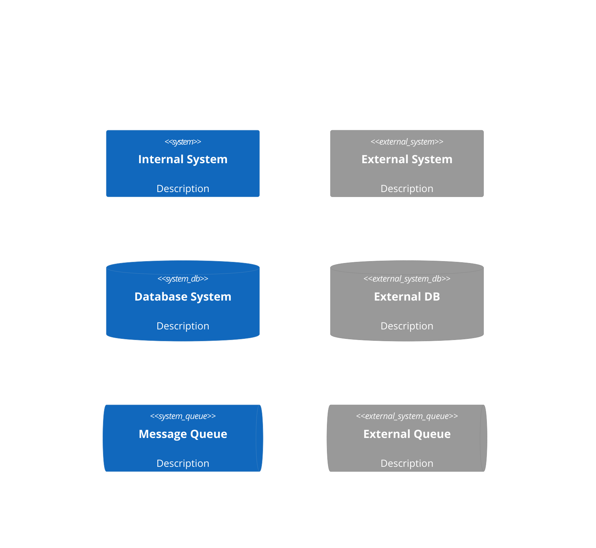
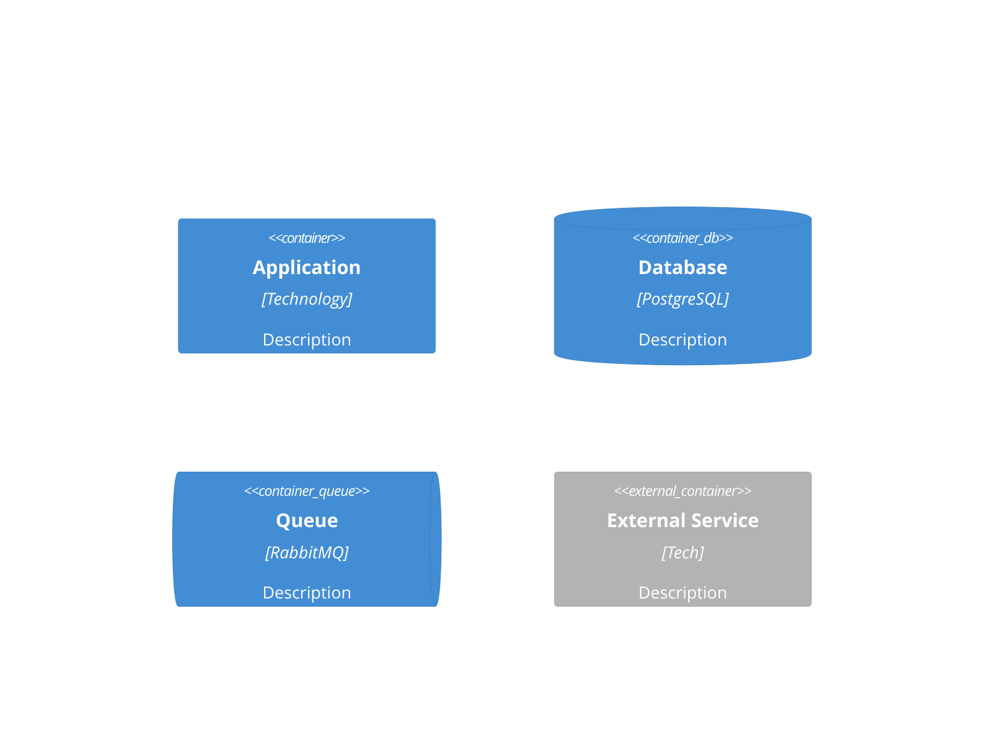
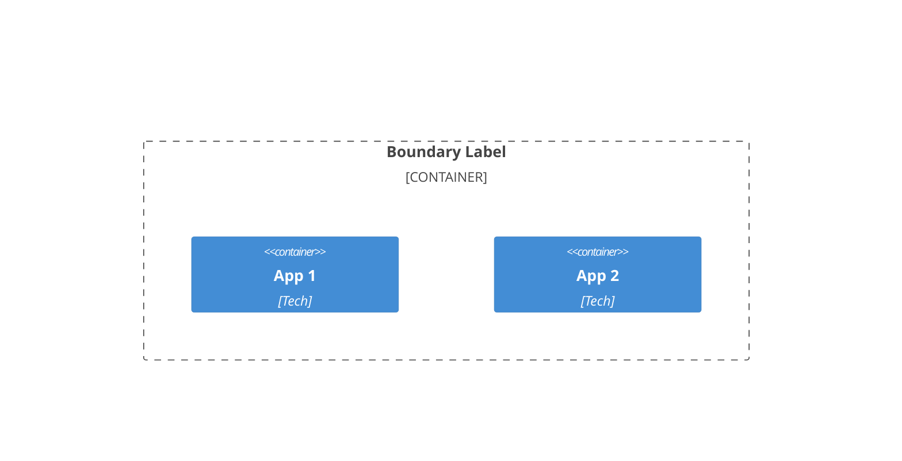

# C4 Model Diagrams

The C4 model provides a hierarchical way to visualize software architecture at different levels of abstraction: Context, Containers, Components, and Code.

## C4 Model Levels

1. **System Context** - Shows the system and its users/external systems
2. **Container** - Shows applications, databases, and services within the system
3. **Component** - Shows internal structure of containers
4. **Code** - Class diagrams showing implementation details (use regular class diagrams)

## C4 Context Diagram

Shows the big picture: your system and its relationships with users and external systems.

### Basic Syntax



### Elements

**People:**


**Systems:**


**Relationships:**
```mermaid
C4Context
    Rel(from, to, "Label")
    Rel(from, to, "Label", "Optional Technology")
    BiRel(system1, system2, "Bidirectional")
```

### Comprehensive Context Example

```mermaid
C4Context
    title System Context - E-Commerce Platform
    
    Person(customer, "Customer", "Shops online")
    Person(admin, "Administrator", "Manages products and orders")
// ... (19 lines trimmed)
    
    UpdateRelStyle(customer, ecommerce, $offsetX="-50", $offsetY="-30")
    UpdateRelStyle(admin, ecommerce, $offsetX="50", $offsetY="-30")
```

## C4 Container Diagram

Zooms into the system to show containers (applications, databases, services).

### Basic Syntax

```mermaid
C4Container
    title Container Diagram for Banking System
    
    Person(customer, "Customer")
// ... (8 lines trimmed)
    Rel(web, api, "Makes API calls", "HTTPS/JSON")
    Rel(api, db, "Reads/writes", "SQL/TCP")
```

### Container Elements



### Container Boundaries



### Comprehensive Container Example

```mermaid
C4Container
    title Container Diagram - E-Commerce Platform
    
    Person(customer, "Customer")
    Person(admin, "Admin")
// ... (42 lines trimmed)
    Rel(notification, queue, "Consumes events", "AMQP")
    Rel(notification, email, "Sends via", "SMTP")
    Rel(order, payment, "Processes payment", "HTTPS/REST")
```

## C4 Component Diagram

Zooms into a container to show its internal components.

### Basic Syntax

```mermaid
C4Component
    title Component Diagram for API Application
    
    Container(web, "Web App", "React")
    ContainerDb(db, "Database", "PostgreSQL")
// ... (12 lines trimmed)
    Rel(repository, db, "Reads/writes", "SQL")
    Rel(service, emailClient, "Sends emails via")
    Rel(emailClient, email, "Sends", "SMTP")
```

### Comprehensive Component Example

```mermaid
C4Component
    title Component Diagram - Order Service
    
    Container(api_gateway, "API Gateway", "Node.js")
    ContainerDb(postgres, "Database", "PostgreSQL")
// ... (25 lines trimmed)
    Rel(inventory_client, inventory, "Calls", "HTTPS/REST")
    Rel(repository, postgres, "Reads/writes", "JDBC/SQL")
    Rel(event_publisher, queue, "Publishes to", "AMQP")
```

## Microservices Architecture Example

```mermaid
C4Container
    title Microservices Architecture - Streaming Platform
    
    Person(user, "User", "Platform user")
    Person(creator, "Content Creator", "Uploads videos")
// ... (60 lines trimmed)
    Rel(analytics, event_bus, "Publishes ViewStarted", "Kafka")
    Rel(recommendation, event_bus, "Consumes events", "Kafka")
    Rel(search, event_bus, "Consumes events", "Kafka")
```

## Best Practices

1. **Appropriate level** — Context for stakeholders, Container for architects, Component for developers
2. **Keep focused** — One system per Context, one container per Component diagram
3. **Consistent naming** — Same names across all diagram levels
4. **Technology labels** — Specify frameworks, protocols at Container/Component level
5. **Use boundaries** — Group related containers/components logically
6. **Under 20 elements** — Split complex diagrams into multiple focused views

## Architecture Patterns

### Multi-Team Microservices

When separate teams own services, promote each to a **software system** at Context level:

```mermaid
C4Context
  title E-commerce - Multi-Team

  Person(customer, "Customer", "Online shopper")

// ... (9 lines trimmed)
  Rel(orderSystem, userSystem, "Authenticates")
  Rel(orderSystem, productSystem, "Checks inventory")
  Rel(orderSystem, payment, "Processes payments")
```

Single team → model services as **containers** within one system boundary.

### Event-Driven (Individual Topics)

Always model message topics as separate containers, not a single "Kafka" box:

```mermaid
C4Container
  title Event-Driven Order Processing

  Container(orderSvc, "Order Service", "Java", "Creates orders")
  Container(inventorySvc, "Inventory Service", "Go", "Manages stock")
// ... (11 lines trimmed)
  Rel(orderSvc, paymentComplete, "Consumes", "Avro")

  UpdateLayoutConfig($c4ShapeInRow="4")
```

### CQRS

```mermaid
C4Container
  title CQRS Architecture

  Person(user, "User", "Application user")

// ... (15 lines trimmed)
  Rel(projector, events, "Consumes", "Avro")
  Rel(projector, readDb, "Updates", "REST")
  Rel(queryApi, readDb, "Queries", "REST")
```

### API Gateway with BFF

```mermaid
C4Container
  title API Gateway Architecture

  Person(mobile, "Mobile User")
  Person(web, "Web User")
// ... (15 lines trimmed)
  Rel(bff, gateway, "REST", "HTTP")
  Rel(gateway, userApi, "Routes /users/*", "HTTP")
  Rel(gateway, orderApi, "Routes /orders/*", "HTTP")
```

## Deployment Patterns

### AWS Production

```mermaid
C4Deployment
  title Production - AWS us-east-1

  Deployment_Node(vpc, "VPC", "10.0.0.0/16") {
    Deployment_Node(public, "Public Subnets", "Multi-AZ") {
// ... (16 lines trimmed)
  Rel(lb, api2, "Routes", "HTTP")
  Rel(api1, primary, "Queries", "JDBC")
  Rel(api2, primary, "Queries", "JDBC")
```

### Kubernetes

```mermaid
C4Deployment
  title Production - Kubernetes

  Deployment_Node(ingress, "Ingress Controller", "nginx") {
    Container(nginx, "Nginx", "nginx-ingress", "TLS, routing")
// ... (18 lines trimmed)
  Rel(nginx, api, "Routes /api/*", "HTTP")
  Rel(api, pg, "Queries", "JDBC")
  Rel(worker, pg, "Processes", "JDBC")
```

## Dynamic Diagram Patterns

### OAuth2 Flow

```mermaid
C4Dynamic
  title OAuth2 Authorization Code Flow

  Container(spa, "SPA", "React", "Web application")
// ... (6 lines trimmed)
  Rel(api, auth0, "4. POST /oauth/token", "HTTPS")
  Rel(api, spa, "5. Return access + refresh tokens")
```

### Event Processing Sequence

```mermaid
C4Dynamic
  title Order Processing Flow

  Container(orderSvc, "Order Service", "Java")
  Container(inventorySvc, "Inventory Service", "Go")
// ... (8 lines trimmed)
  Rel(inventorySvc, stockReserved, "3. Publishes reservation", "Avro")
  Rel(paymentSvc, stockReserved, "4. Consumes reservation", "Avro")
  Rel(paymentSvc, paymentComplete, "5. Publishes payment", "Avro")
```

## ADR Integration

Link diagrams to Architecture Decision Records:

```mermaid
C4Container
  title System Architecture
  %% See ADR-001 for API Gateway selection
  %% See ADR-002 for database choice
// ... (7 lines trimmed)
  Rel(api, db, "Persists", "JDBC")
  Rel(api, events, "Publishes", "Avro")
```

Output convention:
```
docs/architecture/
├── c4-context.md
├── c4-containers.md
├── c4-components-{feature}.md
├── c4-deployment.md
└── c4-dynamic-{flow}.md
```
