# Flowcharts

Flowcharts visualize processes, algorithms, decision trees, and user journeys. They show step-by-step progression through a system or workflow.

## Basic Syntax


**Directions:**
- `TD` or `TB` - Top to Bottom (default)
- `BT` - Bottom to Top
- `LR` - Left to Right
- `RL` - Right to Left

## Node Shapes

### Rectangle (default)
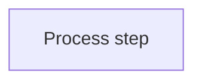

### Rounded Rectangle
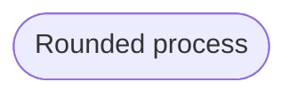

### Stadium/Pill Shape
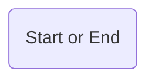

### Subroutine (Double Border)
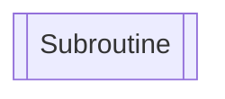

### Cylindrical (Database)
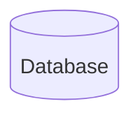

### Circle
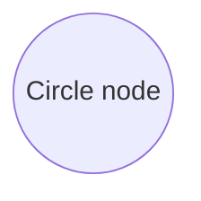

### Asymmetric/Flag
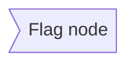

### Rhombus (Decision)
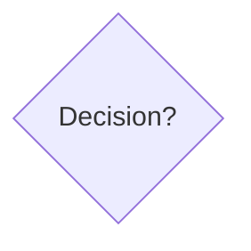

### Hexagon
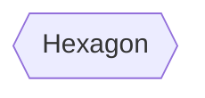

### Parallelogram (Input/Output)
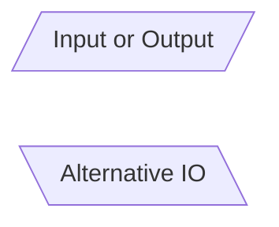

### Trapezoid
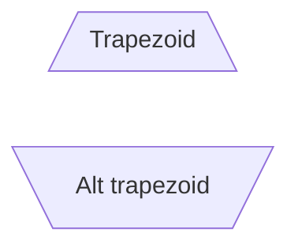

## Connections

### Basic Arrow
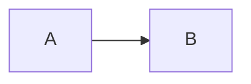

### Open Link (No Arrow)
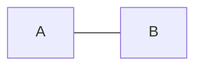

### Text on Links
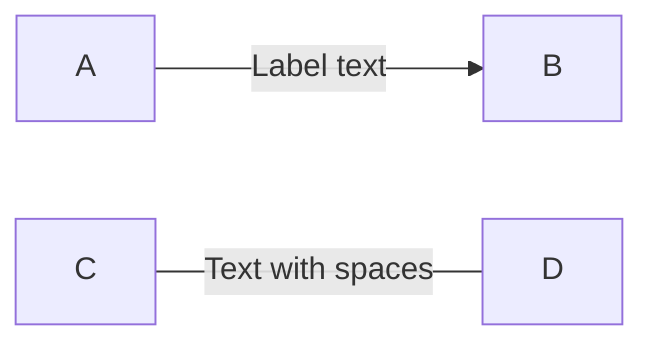

### Dotted Links
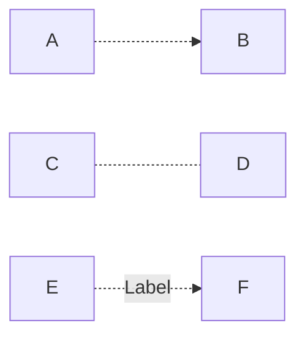

### Thick Links
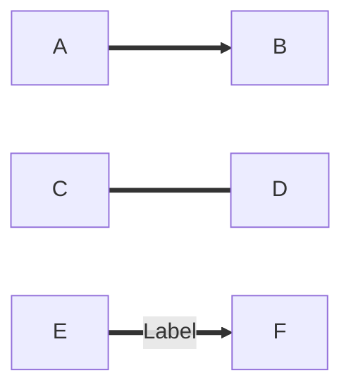

### Chaining
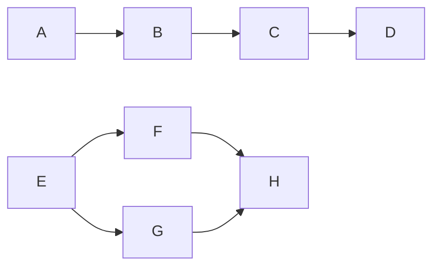

### Multi-directional
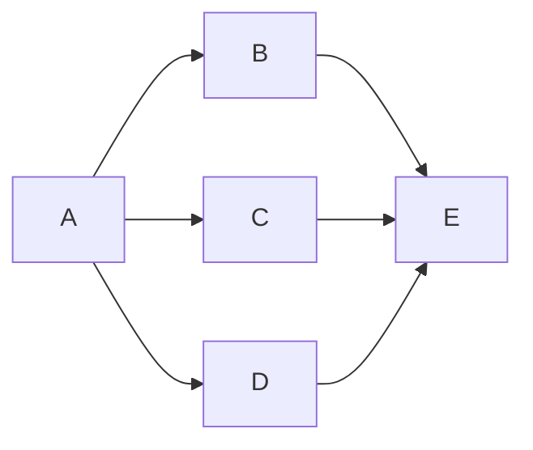

## Subgraphs

Group related nodes:

```mermaid
flowchart TB
    A[Start]
    
    subgraph Processing
// ... (7 lines trimmed)
    A --> B
    D --> E
```

### Nested Subgraphs
```mermaid
flowchart TB
    subgraph Outer
        A[Node A]
        
        subgraph Inner
            B[Node B]
            C[Node C]
        end
    end
```

### Subgraph Direction
```mermaid
flowchart LR
    subgraph one
        direction TB
        A1 --> A2
// ... (6 lines trimmed)
    
    one --> two
```

## Styling

### Individual Node Styling
```mermaid
flowchart LR
    A[Normal]
    B[Styled]
    
    style B fill:#ff6b6b,stroke:#333,stroke-width:4px,color:#fff
```

### Class-based Styling
```mermaid
flowchart LR
    A[Node 1]:::className
    B[Node 2]:::className
    C[Node 3]
    
    classDef className fill:#f9f,stroke:#333,stroke-width:2px
```

### Link Styling
```mermaid
flowchart LR
    A --> B
    linkStyle 0 stroke:#ff3,stroke-width:4px,color:red
```

## Comprehensive Example: User Registration Flow

```mermaid
flowchart TD
    Start([User visits registration page]) --> Form[Show registration form]
    Form --> Input[User enters details]
    Input --> Validate{Valid input?}
    
// ... (17 lines trimmed)
    style End fill:#90EE90,stroke:#333,stroke-width:2px
    style CreateAccount fill:#87CEEB,stroke:#333,stroke-width:2px
    style SaveDB fill:#FFD700,stroke:#333,stroke-width:2px
```

## Algorithm Example: Binary Search

```mermaid
flowchart TD
    Start([Start Binary Search]) --> Init[Set low = 0, high = array.length - 1]
    Init --> Check{low <= high?}
    
    Check -->|No| NotFound[Return -1: Not found]
// ... (17 lines trimmed)
    style End fill:#90EE90
    style Found fill:#FFD700
    style NotFound fill:#FF6B6B
```

## CI/CD Pipeline

```mermaid
flowchart LR
    subgraph Development
        Commit[Developer commits code] --> Push[Push to repository]
    end
    
// ... (25 lines trimmed)
    
    Test -->|Failed| NotifyDev[Notify developer]
    NotifyDev --> FixIssues
```

## E-Commerce Checkout Flow

```mermaid
flowchart TD
    Start([User clicks Checkout]) --> Auth{Authenticated?}
    
    Auth -->|No| Login[Redirect to login]
    Login --> Auth
// ... (36 lines trimmed)
    style Success fill:#90EE90
    style Cancel fill:#FF6B6B
    style CreateOrder fill:#FFD700
```

## Decision Matrix Example

```mermaid
flowchart TD
    Start([Select deployment strategy]) --> Env{Environment?}
    
    Env -->|Development| DevDecision{Automated tests?}
    DevDecision -->|Pass| DevDeploy[Auto-deploy to dev]
// ... (26 lines trimmed)
    Monitor --> End([Deployment complete])
    Block --> End
    Wait --> End
```

## Best Practices

1. **Use meaningful labels** - Node text should be clear and action-oriented
2. **Consistent node shapes** - Same shapes for same types of actions
3. **Decision nodes as diamonds** - Standard convention for yes/no decisions
4. **Flow top-to-bottom or left-to-right** - Natural reading direction
5. **Start and end nodes** - Use stadium/pill shapes to mark entry/exit
6. **Group related steps** - Use subgraphs for logical groupings
7. **Color code** - Use colors to highlight different types of actions
8. **Minimize crossing lines** - Reorganize for clarity
9. **Keep it focused** - One process per diagram

## Common Patterns

### Simple Linear Flow
```mermaid
flowchart LR
    A[Step 1] --> B[Step 2] --> C[Step 3] --> D[Step 4]
```

### Branching Decision
```mermaid
flowchart TD
    A[Input] --> B{Condition?}
    B -->|True| C[Path 1]
    B -->|False| D[Path 2]
    C --> E[Merge]
    D --> E
```

### Loop Pattern
```mermaid
flowchart TD
    A[Initialize] --> B[Process]
    B --> C{Continue?}
    C -->|Yes| B
    C -->|No| D[Exit]
```

### Error Handling
```mermaid
flowchart TD
    A[Try operation] --> B{Success?}
    B -->|Yes| C[Continue]
    B -->|No| D[Handle error]
    D --> E{Retry?}
    E -->|Yes| A
    E -->|No| F[Abort]
```
